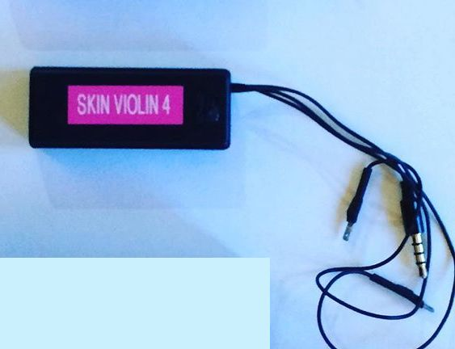
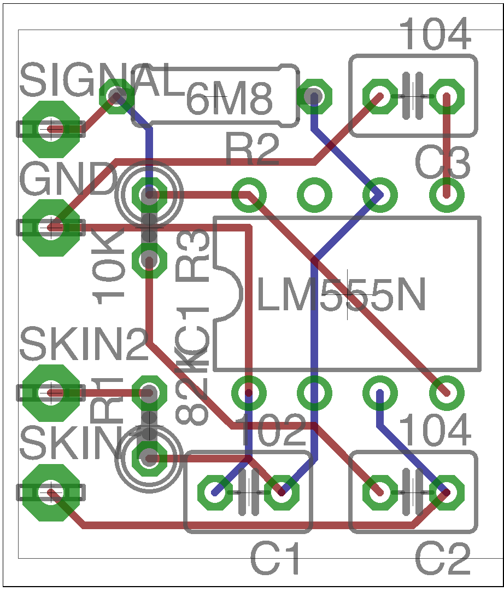
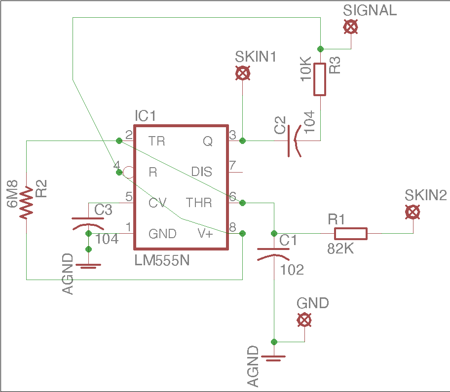

# Skin Orchestra
Turn an Android phone into a MIDI/OSC skin touch sensor with this simple, tiny, battery-free circuit.

An EAGLE board design. I made this years ago and have moved onto KiCAD and SMD since. We have also moved onto a pure digital touch sensor design integrated with our wearable LED costumes, so this circuit is not likely to be under active development again.

However, it's been tested with many different Android phones, and works well in practice. You might want to use the "phantom power" idea to run other devices off a microphone port without needing batteries.

## Concept

This circuit is an oscillator which runs on the bias voltage that can be extracted from an Android smartphone's microphone jack. Therefore, a low current CMOS 555 timer must be used. Check your phone's specifications before connecting this circuit - you use it completely at your own risk.

Once plugged into an Android phone, the pads marked "skin" can be bridged by skin contact, which produces a variable frequency square wave across the microphone input.

You can use this "as is" for a simple tone, but this signal can also be processed by an Android app, which counts the zero-crossing frequency of the square wave and converts it to MIDI or OSC (app coming soon).

## Construction

This board design only uses a few through-hole components, so it should be easy to construct. You could also build it easily with veroboard or on a breadboard if you don't want to fabricate the board.

To connect to the smartphone, use a standard 4-pin headphone/microphone connector. Connect ground to ground, and the microphone to "SIGNAL". Check your phone's headphone jack pinout to make sure you have the right channels on the connector.

## Usage

You can give one wire to somebody else, and hold the other yourself. The harder you squeeze them, the higher the notes will be from the circuit.

## Safety

Use this design at your own risk. Do not plug the phone into a charger and then connect it to someone - there should never be a conductive connection between a person's body and a device wired to mains power.

## Acknowledgements

This project is a concept developed by Alma Edelstein-Feinsilber, James Hudson, and Patricio Zarazaga, to allow skin-touch control of musical instruments in 2014.
